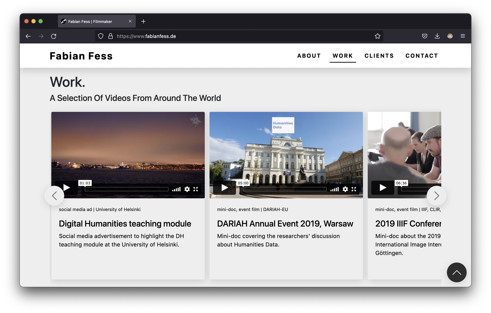

# Portfolio site: Fabian Fess

This website is a one-pager. It is build using the Bootstrap grid and nav, heavy custom styles (SCSS) and JavaScript (mostly vanilla JS and some jQuery).

Find the live site here: [www.fabianfess.de](https://www.fabianfess.de/).

  
  

